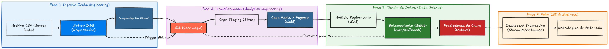

# E-commerce Churn Prediction Model

##  Descripción
Este proyecto consiste en el desarrollo de un sistema end-to-end para la predicción de abandono (churn) en una plataforma de e-commerce. Utiliza una arquitectura moderna de datos con contenedores Docker para orquestar la ingesta, transformación y modelado de datos.

El objetivo principal es identificar patrones de comportamiento que señalen una posible fuga de clientes, permitiendo al equipo de marketing tomar acciones proactivas de retención.



## Características Principales
- **Pipeline de Datos Automatizado**: Orquestación con Apache Airflow.
- **Transformaciones de Datos**: Modelado y limpieza utilizando dbt (data build tool).
- **Almacenamiento**: Data Warehouse basado en PostgreSQL.
- **Análisis Predictivo**: Modelo de Machine Learning para estimar la probabilidad de churn.
- **Segmentación**: Clasificación de clientes en perfiles de riesgo (Alto, Medio, Bajo).

## Stack Tecnológico
- **Base de Datos**: PostgreSQL 15
- **Orquestación**: Apache Airflow
- **Transformaciones**: dbt
- **Contenedores**: Docker & Docker Compose
- **Visualización**: pgAdmin 4 (para gestión de DB)

## Estructura del Proyecto
```text
.
├── dags/                # Definiciones de DAGs de Airflow
├── dbt_project/         # Modelos y transformaciones dbt
├── data/                # Datasets y archivos CSV
├── image/               # Imágenes y diagramas
├── notebooks/           # Análisis exploratorios y prototipado
├── logs/                # Logs de Airflow
├── plugins/             # Plugins personalizados de Airflow
├── docker-compose.yml   # Orquestación de servicios
└── Dockerfile           # Imagen personalizada para Airflow + dbt
```

## Configuración e Instalación

### Requisitos Previos
- Docker y Docker Compose instalados.
- Copiar el archivo `.env.example` a `.env` y configurar las credenciales.

### Despliegue
1. Clonar el repositorio.
2. Configurar el archivo `.env`:
   ```bash
   cp .env.example .env
   ```
3. Levantar los servicios:
   ```bash
   docker-compose up -d
   ```

### Acceso a Servicios
- **Airflow Webserver**: [http://localhost:8080](http://localhost:8080)
- **JupyterLab**: [http://localhost:8888](http://localhost:8888)
- **pgAdmin**: [http://localhost:5050](http://localhost:5050)
- **Postgres**: localhost:5432

## Metodología (Ciclo de Vida de los Datos)
El proyecto sigue un enfoque iterativo diseñado para garantizar la calidad y reproducibilidad de los resultados:

1. **EDA Inicial (Exploración de Calidad)**:
   - Inspección rápida de `data/raw` para entender tipos de datos, nulos y consistencia.
   - Definición de reglas de limpieza para el proceso de transformación.

2. **ETL / Pipeline (Automatización)**:
   - **Extract & Load**: Ingesta del dataset a PostgreSQL orquestado por **Airflow**.
   - **Transform (dbt)**: Limpieza formal, normalización y creación de modelos analíticos en el warehouse.

3. **EDA Profundo y Modelado**:
   - Análisis de correlaciones y distribuciones sobre los datos transformados.
   - Entrenamiento de modelos (Random Forest, XGBoost) priorizando el **Recall (> 0.7)** para maximizar la detección de clientes en riesgo de churn.

---
*Este proyecto fue desarrollado por el Equipo 42 como parte de la simulación de No Country.*
